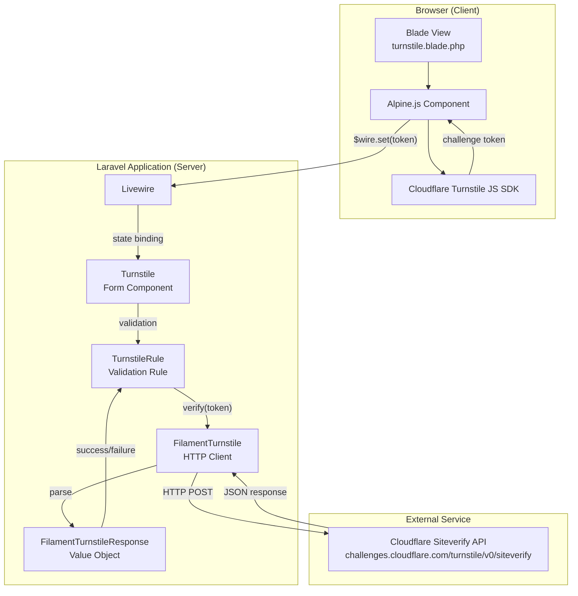
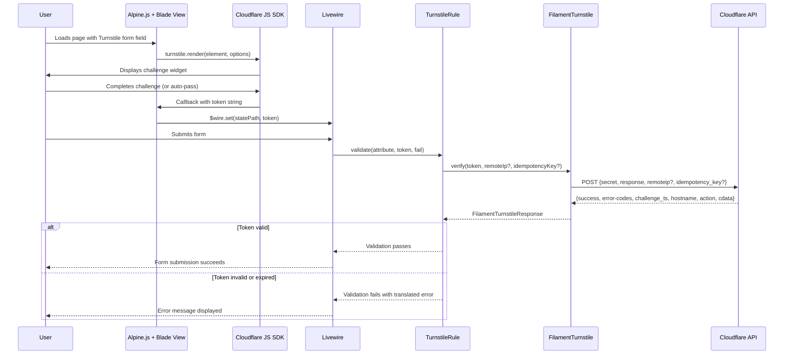
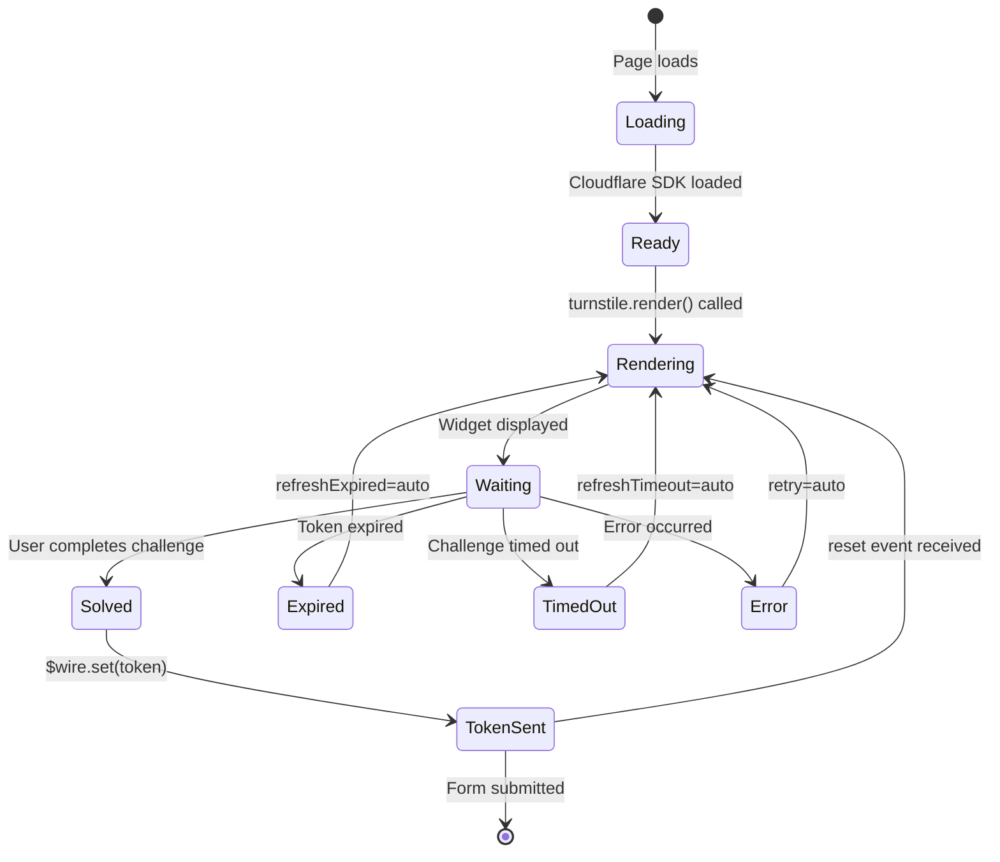
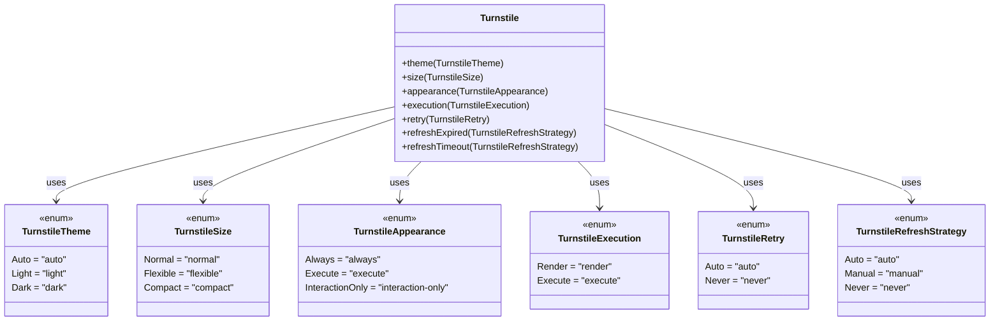

# Architecture Overview

Filament Turnstile is a Laravel package that integrates Cloudflare Turnstile CAPTCHA into Filament v4+ forms. It provides a drop-in form component, server-side token verification, and type-safe configuration through PHP enums.

## Table of Contents

- [System Overview](#system-overview)
- [Component Diagram](#component-diagram)
- [Data Flow](#data-flow)
- [Key Classes](#key-classes)
- [Blade View and Alpine.js](#blade-view-and-alpinejs)
- [Enum Configuration Types](#enum-configuration-types)
- [Service Provider and Registration](#service-provider-and-registration)
- [Error Handling](#error-handling)

## System Overview

The package bridges three systems:

1. **Cloudflare Turnstile** -- the external CAPTCHA service that issues and verifies challenge tokens.
2. **Filament Forms** -- the UI framework where the Turnstile widget renders as a form field.
3. **Laravel HTTP + Validation** -- the server-side layer that verifies tokens against the Cloudflare API before accepting form submissions.

The widget runs entirely client-side using Cloudflare's JavaScript SDK and Alpine.js. When the user completes the challenge, a token is sent to the server via Livewire. On form submission, the `TurnstileRule` validation rule calls the Cloudflare siteverify API to confirm the token is valid.

## Component Diagram

## Data Flow

The following sequence describes the full lifecycle of a Turnstile verification during form submission.

## Key Classes

### `FilamentTurnstile` -- HTTP Client

**Namespace:** `l3aro\FilamentTurnstile`

The core service class. Sends token verification requests to the Cloudflare siteverify endpoint. Registered as a singleton in the container and accessible via the `FilamentTurnstileFacade` facade.

**Responsibilities:**
- Builds the verification payload (secret, response token, optional remoteip and idempotency_key).
- Sends an HTTP POST with configurable retry logic (`retry_times`, `retry_delay`) and timeout.
- Parses the Cloudflare JSON response into a `FilamentTurnstileResponse` value object.
- Exposes the configured reset event name.

### `FilamentTurnstileResponse` -- Value Object

**Namespace:** `l3aro\FilamentTurnstile`

An immutable value object (all properties are `readonly`) that represents the Cloudflare API response. Implements `Arrayable` for easy serialization.

**Properties:** `success`, `errorCodes`, `challengeTs`, `hostname`, `action`, `cData`.

**Key methods:** `isSuccess()`, `isExpired()`, `toArray()`.

### `Turnstile` -- Filament Form Component

**Namespace:** `l3aro\FilamentTurnstile\Forms`

Extends `Filament\Forms\Components\Field`. This is the main integration point for developers. Added to Filament forms like any other field component.

**Responsibilities:**
- Configures the Turnstile widget options (theme, size, appearance, execution mode, retry behavior, refresh strategies, action, cData, feedback).
- Automatically applies the `TurnstileRule` validation rule.
- Renders via the `filament-turnstile::forms.turnstile` Blade view.
- Supports Filament alignment via the `HasAlignment` trait.
- Marked as `required`, `hiddenLabel`, and `dehydrated(false)` by default (the token is transient and never stored).

### `TurnstileRule` -- Validation Rule

**Namespace:** `l3aro\FilamentTurnstile\Rules`

Implements Laravel's `ValidationRule` interface. Called during form validation to verify the Turnstile token server-side.

**Responsibilities:**
- Rejects empty or non-string values with a translated error.
- Calls `FilamentTurnstile::verify()` with optional `remoteIp` and `idempotencyKey`.
- Maps Cloudflare error codes to translated error messages via the `filament-turnstile::errors` language file.

### `FilamentTurnstileFacade` -- Facade

**Namespace:** `l3aro\FilamentTurnstile\Facades`

Standard Laravel facade proxying to the `FilamentTurnstile` service class. Provides static access to `verify()` and `getResetEventName()`.

### `FilamentTurnstileServiceProvider` -- Service Provider

**Namespace:** `l3aro\FilamentTurnstile`

Uses `spatie/laravel-package-tools` for package registration. Handles config, translations, views, and the install command. Mixes `TestsFilamentTurnstile` into Livewire's `Testable` class on boot.

## Blade View and Alpine.js

The Blade template (`resources/views/forms/turnstile.blade.php`) orchestrates the client-side widget:

1. **Script loading** -- Uses Filament's `x-load-js` to load the Cloudflare Turnstile SDK with `render=explicit` mode.
2. **Alpine.js component** -- Manages widget state (`widgetId`) and Livewire state binding via `$wire.entangle`.
3. **Widget rendering** -- Calls `turnstile.render()` with options derived from the PHP component's getter methods.
4. **Callbacks** -- On success, sets the Livewire state to the token. On error, expiry, or timeout, clears the state to `null`.
5. **Reset support** -- Listens for a configurable Livewire event to reset the widget.
6. **Cleanup** -- Removes the widget when the Alpine component is destroyed.

## Enum Configuration Types

All enums are string-backed and located in `l3aro\FilamentTurnstile\Enums`.

## Error Handling

The package translates Cloudflare error codes into user-facing messages. The translation keys live in `resources/lang/en/errors.php`:

| Cloudflare Error Code | Translation Key | Default Message |
|---|---|---|
| `missing-input-secret` | `filament-turnstile::errors.missing-input-secret` | The secret key is missing. |
| `invalid-input-secret` | `filament-turnstile::errors.invalid-input-secret` | The secret key is invalid. |
| `missing-input-response` | `filament-turnstile::errors.missing-input-response` | The response is missing. |
| `invalid-input-response` | `filament-turnstile::errors.invalid-input-response` | The response is invalid or has expired. |
| `bad-request` | `filament-turnstile::errors.bad-request` | The request was rejected because it was malformed. |
| `timeout-or-duplicate` | `filament-turnstile::errors.timeout-or-duplicate` | The response has already been validated before. |
| `internal-error` | `filament-turnstile::errors.internal-error` | An internal error happened while validating the response. |
| (no error codes) | `filament-turnstile::errors.unexpected` | An unexpected error occurred. |

Error messages can be customized by publishing the language files or adding translations for additional locales.
